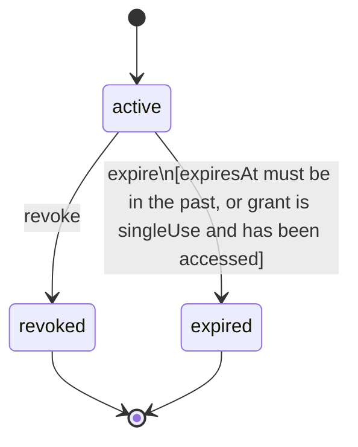

<!-- @generated by @quoin/generator-docs — do not edit -->
# Grant

A signed consent record: which claims are shared with which party, for what purpose, until when

> **Goal:** Be the authoritative record of every access decision, enabling revocation and audit

## Fields

| Name | Type | Required | PII | Description |
| ---- | ---- | -------- | --- | ----------- |
| `id` | uuid | yes |  |  |
| `ownerId` | uuid | yes |  |  |
| `granteeRef` | string | yes |  | Opaque identifier for the recipient (DID, email, app name, URL) |
| `claimIds` | json | yes |  | Ordered list of Claim.id values included in this grant |
| `purpose` | string | yes |  | Human-readable statement of why the data is shared |
| `mode` | enum (`push`, `pull`) | yes |  | push = encrypted bundle handed to grantee; pull = relay serves on request |
| `singleUse` | boolean | yes |  | If true, grant is automatically revoked after first access |
| `expiresAt` | timestamp | no |  | Hard expiry; null means no expiry for pull grants |
| `ownerSig` | string | yes |  | Ed25519 signature over the canonical grant payload, base64url |
| `status` | enum (`active`, `revoked`, `expired`) | yes |  |  |
| `createdAt` | timestamp | yes |  |  |
| `revokedAt` | timestamp | no |  |  |

### State Machine

**Field:** `status`  **Initial:** `active`

**States:**

| State | Description | Terminal |
| ----- | ----------- | -------- |
| `active` | Grant is valid; relay will serve data for pull grants |  |
| `revoked` | Owner explicitly revoked; relay refuses further access | yes |
| `expired` | Past expiresAt or consumed if singleUse | yes |

**Transitions:**

| From | To | Trigger | Guards | Effects |
| ---- | --- | ------- | ------ | ------- |
| `active` | `revoked` | `revoke` |  | Sets revokedAt to now; relay stops serving this grant immediately |
| `active` | `expired` | `expire` | expiresAt must be in the past, or grant is singleUse and has been accessed |  |

## Behaviors

### `revoke`

Immediately invalidates the grant; relay stops serving data for pull grants

**Rules:**
- Only the vault owner may revoke a grant

**Auth:** roles `owner`

### `expire`

System-triggered: marks the grant expired when past its expiresAt or after single-use access

**Rules:**
- expiresAt must be in the past, or grant is singleUse and has been accessed

**Auth:** roles `system`

## Relations

| Name | Kind | Target | Foreign Key |
| ---- | ---- | ------ | ----------- |
| `owner` | belongsTo | `VaultUser` | `ownerId` |
