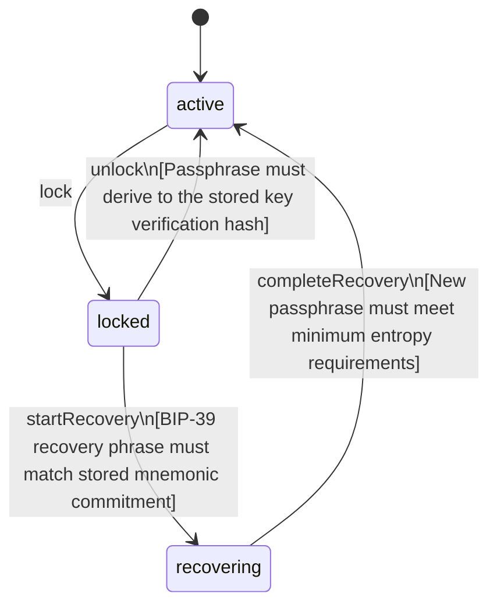

<!-- @generated by @quoin/generator-docs — do not edit -->
# VaultUser

The vault owner, identified by a self-sovereign DID

> **Goal:** Hold the owner DID and track the vault lifecycle state

## Fields

| Name | Type | Required | PII | Description |
| ---- | ---- | -------- | --- | ----------- |
| `id` | uuid | yes |  |  |
| `did` | string | yes |  | did:key identifier derived from the owner Ed25519 keypair |
| `displayName` | string | no |  | Optional human-readable label shown in the UI |
| `status` | enum (`active`, `locked`, `recovering`) | yes |  |  |
| `createdAt` | timestamp | yes |  |  |

### State Machine

**Field:** `status`  **Initial:** `active`

**States:**

| State | Description | Terminal |
| ----- | ----------- | -------- |
| `active` | Vault is unlocked and fully operational |  |
| `locked` | Passphrase session expired; vault is sealed |  |
| `recovering` | Recovery phrase entered; awaiting new passphrase |  |

**Transitions:**

| From | To | Trigger | Guards | Effects |
| ---- | --- | ------- | ------ | ------- |
| `active` | `locked` | `lock` |  | Wipes in-memory derived keys |
| `locked` | `active` | `unlock` | Passphrase must derive to the stored key verification hash |  |
| `locked` | `recovering` | `startRecovery` | BIP-39 recovery phrase must match stored mnemonic commitment |  |
| `recovering` | `active` | `completeRecovery` | New passphrase must meet minimum entropy requirements | Re-derives and re-wraps all vault keys with the new passphrase |

## Behaviors

### `lock`

Seals the vault by wiping session keys from memory

**Auth:** roles `owner`

### `unlock`

Unseals the vault by verifying the passphrase and re-deriving session keys

**Rules:**
- Passphrase must derive to the stored key verification hash

**Auth:** roles `owner`

### `startRecovery`

Initiates account recovery using the BIP-39 recovery phrase

**Rules:**
- BIP-39 recovery phrase must match stored mnemonic commitment

**Auth:** roles `owner`

### `completeRecovery`

Finalises recovery by setting a new passphrase and re-wrapping vault keys

**Rules:**
- New passphrase must meet minimum entropy requirements

**Auth:** roles `owner`

